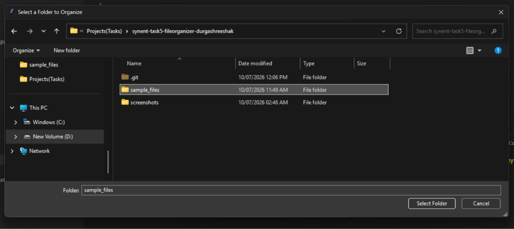
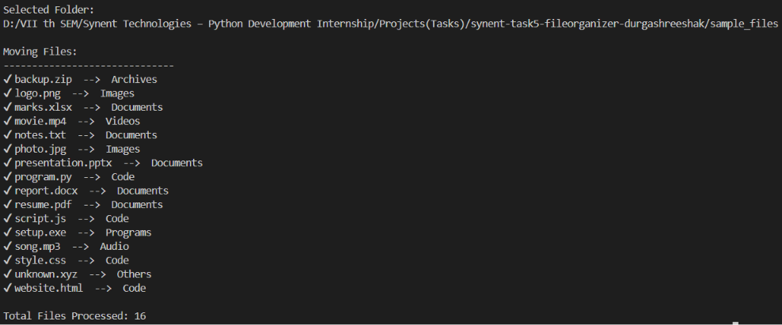
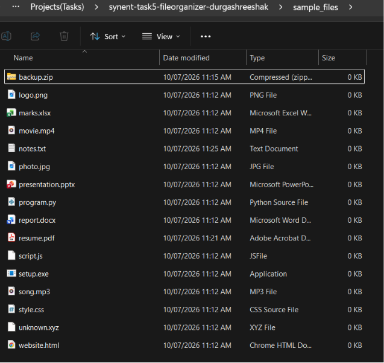
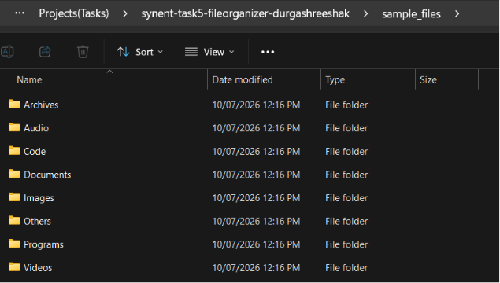
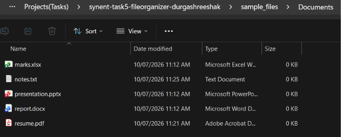

# 📂 File Organizer


A Python-based File Organizer that automatically organizes files into categorized folders based on their file extensions.

This project was developed as **Task 5 – File Organizer** for the **Synent Technologies Python Development Internship Program**.

---

# 📌 Project Overview

Managing folders containing different types of files can quickly become messy and time-consuming. This project automates that process by scanning a selected folder, identifying each file based on its extension, creating category folders when required, and moving every file into the appropriate destination.

The application provides a simple graphical interface for folder selection using **Tkinter** and performs all file operations using Python's built-in libraries.

---

# ✨ Features

- 📁 Graphical folder selection using Tkinter
- 🔍 Automatic file scanning
- 🏷 Automatic file categorization
- 📂 Automatic creation of category folders
- 🚚 Automatic file movement
- 📄 Supports multiple file formats
- 📦 Unknown file types are placed inside **Others**
- 💻 Displays processing status in the terminal
- 🧹 Simple, clean, and modular Python code

---

# 📂 Supported Categories

| Category | Supported Extensions |
|-----------|----------------------|
| Documents | .pdf .doc .docx .txt .ppt .pptx .xls .xlsx |
| Images | .jpg .jpeg .png .gif .bmp .webp |
| Videos | .mp4 .mkv .avi .mov .wmv |
| Audio | .mp3 .wav .aac .flac |
| Archives | .zip .rar .7z .tar .gz |
| Programs | .exe .msi .bat |
| Code | .py .java .c .cpp .html .css .js .json .xml |
| Others | Unsupported file types |

---

# 🛠 Technologies Used

- Python 3
- os
- shutil
- tkinter

---

# 📋 Requirements

- Python 3.x
- Windows Operating System (recommended)
- No external Python libraries required

---

# 📁 Project Structure

```text
synent-task5-fileorganizer-durgashreeshak/
│
├── organizer.py
├── README.md
├── requirements.txt
├── sample_files/
├── screenshots/
└── .gitignore
```

---

# ⚙️ Installation

Clone the repository

```bash
git clone https://github.com/Durgashreeshak/synent-task5-fileorganizer-durgashreeshak.git
```

Move into the project directory

```bash
cd synent-task5-fileorganizer-durgashreeshak
```

---

# ▶️ How to Run

Run the application

```bash
python organizer.py
```

### Workflow

1. Launch the application.
2. Select the folder to organize.
3. The application scans all files.
4. Category folders are created automatically.
5. Files are moved into their respective folders.
6. A processing summary is displayed in the terminal.

> **Note:** It is recommended to organize a copy of your files during testing.

---

# 📷 Sample Output

```text
Moving Files:
------------------------------
✔ report.docx      --> Documents
✔ photo.jpg        --> Images
✔ movie.mp4        --> Videos
✔ song.mp3         --> Audio
✔ script.js        --> Code

Total Files Processed: 16
```

---

# 📸 Screenshots

## Folder Selection



---

## Terminal Output



---

## Before Organization



---

## After Organization



---

## Documents Folder



---

# 🚀 Future Improvements

- Duplicate file handling
- Recursive folder organization
- User-defined categories
- Drag-and-drop support
- Progress bar for large folders
- Logging functionality

---

# 👨‍💻 Author

**Durgashreesha K**

B.E. Artificial Intelligence & Machine Learning

Vivekananda College of Engineering and Technology, Puttur

GitHub:

https://github.com/Durgashreeshak

---

# 📄 License

This project was developed for educational purposes as part of the **Synent Technologies Python Development Internship Program**.